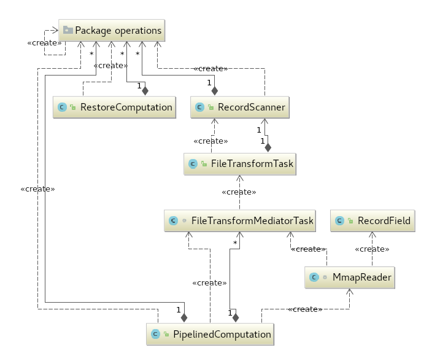
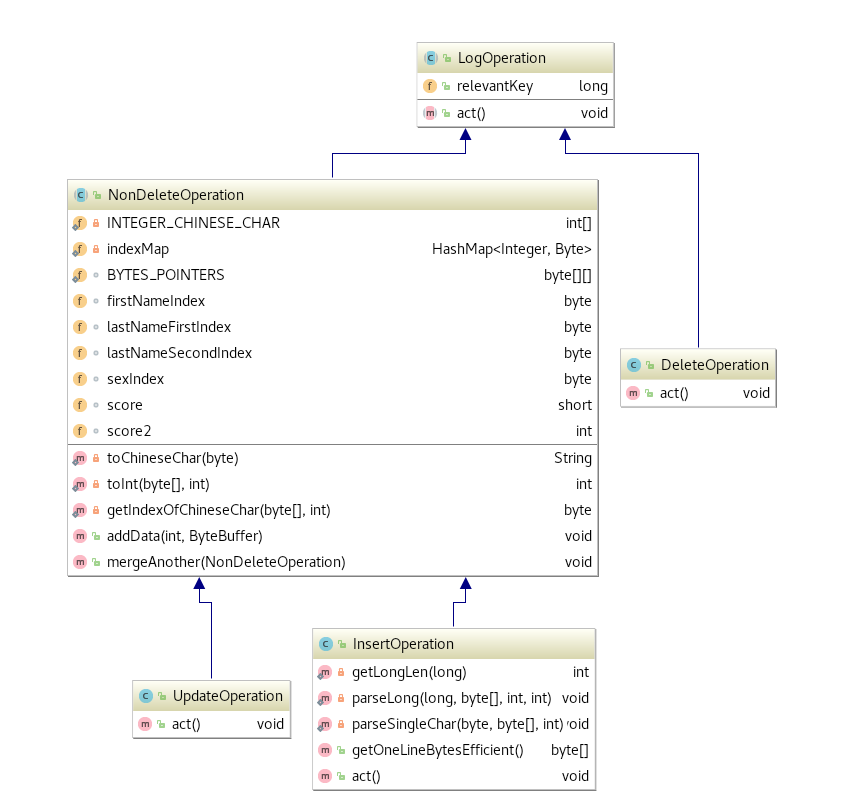

## 算法流程设计

### 基本思路

* 重放算法分为两个阶段，第一个阶段：单线程顺序读取十个文件，重放出数据库中最后时候符合主键在查询范围内的记录；第二个阶段：遍历第一阶段的记录数组，针对每一条记录，插入主键为key并且`byte[]`为value的`ConcurrentSkipListMap`中， 为之后产生出对应的文件作准备。

* Server段在程序启动时候，开启一个线程监听Client连接请求；在最后执行完第二阶段计算时候，遍历有序的 `ConcurrentSkipListMap`， 产生出结果文件对应的 `byte[]`，并使用 java nio 的 `transferTo` 方式直接发送到Client并通过Client Direct Memory进行落盘。

### 流水线的设计

整个重放算法有关的类都放在 `server2` 文件夹下， 其中的类关系如下图所示。



图中有四种不同的actor：

* actor 1: MmapReader(主线程)， 负责顺序读取十个文件，按64MB为单位读取，若文件尾部不满64M就读取相应的大小, 读取之后对应的 `MappedByteBuffer` 会传入一个大小为1的 `BlockingQueue<FileTransformMediatorTask>`, 来让Mediator进行消费。因为阻塞队列的大小为1， 所以内存中最多只有三份 `MappedByteBuffer`(分别于主线程/Mediator线程/BlockingQueue中)， 总大小至多为192MB。

* actor 2: Mediator(单个Mediator线程)， 负责轮询 `BlockingQueue<FileTransformMediatorTask>`来获取任务， 一个任务中包含一个`MappedByteBuffer`和对应的Chunk大小。

轮询的逻辑如下代码所示：

```java
mediatorPool.execute(new Runnable() {
    @Override
    public void run() {
        while (true) {
            try {
                FileTransformMediatorTask fileTransformMediatorTask = mediatorTasks.take();
                if (fileTransformMediatorTask.isFinished)
                    break;
                fileTransformMediatorTask.transform();
            } catch (InterruptedException e) {
                e.printStackTrace();
            }
        }
    }
});
```

在最后读取完所有文件块的时候， 主线程会发送一个任务，通知 Mediator 可以结束了。该逻辑如下所示：

```java
try {
    mediatorTasks.put(new FileTransformMediatorTask());
} catch (InterruptedException e) {
    e.printStackTrace();
}
```

在收到任务后，Mediator负责分配， 保证每个Tokenizer and Parser处理的都是完整的块， 也就是说， 开始的index在`|mysql...`的`|`上， 结束的index在`\n`的后一个上。在这一步中， 需要由Mediator维护好Chunk中末尾'\n'之后的bytes.

关于任务分配，Mediator通过sumbit的方式向Tokenizer and Parser对应线程池提交任务， 并获取`Future<?>`传入下一个FileTransFormTask， 因为重放计算要求保证顺序， 一个任务做完后放入计算队列之前需要等上一个任务结束， 以保证顺序重放的正确性。一开始`Future<?>`的类静态对象被初始化为`isDone = true`。

任务分配相关的核心代码如下(其中关键点在于start, end index的计算和prevRemainingBytes的维护以及prevFuture的维护):

```java
private void submitIfPossible(FileTransformTask fileTransformTask) {
//        if (localPCGlobalStatus[globalIndex] == 1) {
    if (serverPCGlobalStatus[globalIndex] == 1) {
        prevFuture = fileTransformPool.submit(fileTransformTask);
        prevFutureQueue.add(prevFuture);
    }
    globalIndex++;
}

private void assignTransformTasks() {
    int avgTask = currChunkLength / WORK_NUM;

    // index pair
    int start;
    int end = preparePrevBytes();

    // 1st: first worker
    start = end;
    end = computeEnd(avgTask - 1);
    FileTransformTask fileTransformTask;
    if (prevRemainingBytes.limit() > 0) {
        ByteBuffer tmp = ByteBuffer.allocate(prevRemainingBytes.limit());
        tmp.put(prevRemainingBytes);
        fileTransformTask = new FileTransformTask(mappedByteBuffer, start, end, tmp, prevFuture);
    } else {
        fileTransformTask = new FileTransformTask(mappedByteBuffer, start, end, prevFuture);
    }

    submitIfPossible(fileTransformTask);

    // 2nd: subsequent workers
    for (int i = 1; i < WORK_NUM; i++) {
        start = end;
        int smallChunkLastIndex = i < WORK_NUM - 1 ? avgTask * (i + 1) - 1 : currChunkLength - 1;
        end = computeEnd(smallChunkLastIndex);
        fileTransformTask = new FileTransformTask(mappedByteBuffer, start, end, prevFuture);

        submitIfPossible(fileTransformTask);
    }

    // current tail, reuse and then put
    prevRemainingBytes.clear();
    for (int i = end; i < currChunkLength; i++) {
        prevRemainingBytes.put(mappedByteBuffer.get(i));
    }
}
```

* actor 3: Tokenizer and Parser for LogOperation(线程数为16的线程池)
这个逻辑在`FileTransformTask`中，负责对分配到某区间ByteBuffer里面的bytes进行解析，产生出用于重放的LogOperation对象来。 其中主要涉及到主键的解析，类型的解析和必要时LogOperation对象的创建。每个`FileTransformTask`对应一个唯一的`RecordScanner`， `RecordScanner`中封装了解析LogOperation对象的内容。

* actor 4: Restore Computation Worker(单个重放计算线程)， 负责轮询获取任务进行计算， 当遇到大小为0的数组时候退出。

相应任务获取逻辑如下:

```java
computationPool.execute(new Runnable() {
    @Override
    public void run() {
        while (true) {
            try {
                LogOperation[] logOperations = blockingQueue.take();
                if (logOperations.length == 0)
                    break;
                RestoreComputation.compute(logOperations);
            } catch (InterruptedException e) {
                e.printStackTrace();
            }
        }
    }
});
```

主线程通知其结束的逻辑如下：

```java
try {
    blockingQueue.put(new LogOperation[0]);
} catch (InterruptedException e) {
    e.printStackTrace();
}
```




重放线程的逻辑就是顺序遍历取到的任务中每条LogOperation采取相应的行为。

```java
static void compute(LogOperation[] logOperations) {
    for (LogOperation logOperation : logOperations) {
        logOperation.act();
    }
}
```

使用数组来模拟Hashmap表示对应的数据库，下标对应key, 引用对应value， 基于Range固定并且在int表示范围内

```java
public static LogOperation[] ycheArr = new LogOperation[8 * 1024 * 1024];
```

DeleteOperation的操作， 从数据库中删除记录

```java
@Override
public void act() {
    ycheArr[(int) (this.relevantKey)] = null;
}
```


InsertionOperation的操作， 数据库中插入新的记录

```java
@Override
public void act() {
    ycheArr[(int) (this.relevantKey)] = this;
}
```

Update操作， 从数据库中取出对应的记录，并进行属性更新

```java
@Override
public void act() {
    InsertOperation insertOperation = (InsertOperation) RestoreComputation.ycheArr[(int) (this.relevantKey)]; //2
    if(insertOperation==null){
        insertOperation=new InsertOperation(this.relevantKey);
        RestoreComputation.ycheArr[(int) this.relevantKey]=insertOperation;
    }
    insertOperation.mergeAnother(this); //3
}
```
